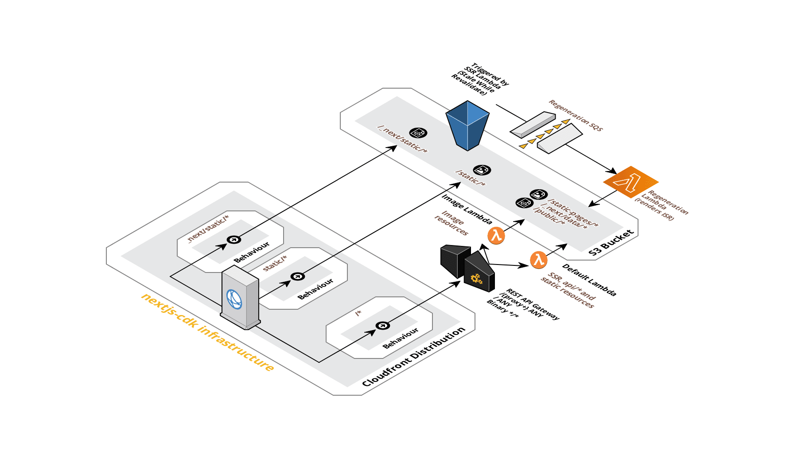

# Next JS CDK

A zero configuration Next.js 11/12 build and CDK component for AWS Lambda@Edge and AWS Lambda with API Gateway aiming for full feature parity.

Most of the code originates from [serverless-next](https://github.com/serverless-nextjs/serverless-next.js) which this component will try to keep even steps with.

## Install

Just run `yarn install`. Dependencies that are used by the `sharp` image component are purposely checked in since they are copied along side the image handler.

## Tests

To be able to fully run the tests the handler code that will be run inside the default and image lambdas have to be bundled using Rollup. That is why this has been added as a `pretest` script.

# Architecture

Three Cache Behaviors are created in CloudFront.

The `/*` is associated to a API Gateway (REST API) which routes the request either to the default or image lambda.

There will also be a Lambda@edge configuration version of this as well that can be used outside of China.
